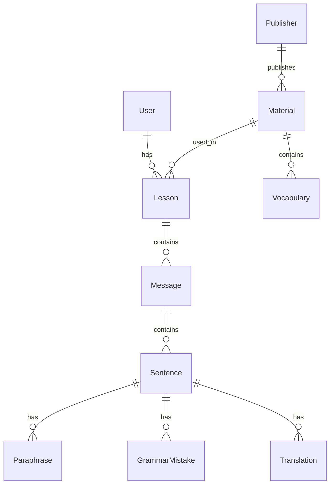

# Orca

Learn English from the news you actually want to read.

Orca turns any news article into a language lesson: it extracts vocabulary at your level, generates a summary, and lets you discuss the article with an AI tutor.

It ships across three clients:

* **Web app**
* **Chrome extension** that works on any page you're browsing
* **iOS / Android app**

---

## The problem

Most English-learning apps and basic AI tutors focus on generic conversation topics such as greetings, ordering food, or making small talk.

That works for beginners, but more serious intermediate and advanced learners often want to practice English by talking about topics they are genuinely interested in.

Orca was built around that problem: instead of giving learners predefined conversation topics, it turns articles they already want to read into personalized English lessons and conversation material.

---

## Core features

- Import an article from the web
- Extract vocabulary based on learner level
- Generate article summaries
- Discuss the article with an AI tutor
- Receive sentence-level grammar feedback
- Get paraphrase suggestions and translations
- Save vocabulary for later review


---

## Tech stack

| Layer                | Technologies                                          |
| -------------------- | ----------------------------------------------------- |
| **Web**              | TypeScript, Next.js, React, MUI, Redux Toolkit |
| **Chrome extension** | Plasmo, React, MUI, Redux Toolkit                     |
| **Mobile**           | TypeScript, Expo, React Native, React Native Paper, Redux Toolkit |
| **API / data**       | Next.js API routes, Prisma, PostgreSQL                |
| **Auth & billing**   | Firebase Auth, Stripe                                 |
| **AI**               | Python, OpenAI, LangChain, Chroma                             |
| **Speech**           | AWS Polly                                             |
| **CMS / content**    | Contentful, NewsData.io                               |
| **Workers**          | Fastify, AWS Lambda, Firebase Cloud Functions         |
| **Observability**    | Mixpanel, Sentry, LogRocket                           |
| **Testing**          | Cypress                                               |

---

## Architecture

All three clients share the same backend and database.

```text
┌──────────────┐   ┌──────────────┐   ┌──────────────┐
│  Web app     │   │ Chrome ext   │   │ iOS/Android │
│  nextjs/     │   │ ce/          │   │ rn/         │
└──────┬───────┘   └──────┬───────┘   └──────┬───────┘
       │                  │                  │
       │        ┌─────────┴────────┐         │
       │        │ Background       │         │
       │        │ service worker   │         │
       │        └─────────┬────────┘         │
       └──────────────────┼──────────────────┘
                          │
                  REST + Firebase ID token
                          │
                  ┌───────▼────────┐
                  │ Next.js API    │
                  │ pages/api      │
                  └───────┬────────┘
                          │
        ┌─────────────────┼─────────────────┐
        │                 │                 │
   ┌────▼────┐       ┌────▼────┐      ┌────▼────┐
   │Postgres │       │ OpenAI  │      │Workers /│
   │ Prisma  │       │         │      │ Lambda  │
   └─────────┘       └─────────┘      └─────────┘


Deprecated AI architecture:

                  ┌──────────────────────┐
                  │ ai/ Python service   │
                  │ Flask + LangChain    │
                  │ Chroma + SSE         │
                  └──────────┬───────────┘
                             │
                  ┌──────────┴───────────┐
                  │                      │
             ┌────▼────┐            ┌────▼────┐
             │Postgres │            │ OpenAI  │
             │ Prisma  │            │ Chroma  │
             └─────────┘            └─────────┘
```

The web app, Chrome extension, and mobile app all use the same Next.js API and data model.

The Chrome extension is slightly different: requests from the injected UI are routed through a Manifest V3 background service worker before reaching the backend.

This avoids network restrictions imposed on content scripts by the host page's Content Security Policy.

The deprecated `ai/` service was the original Python chat backend. It used Flask, LangChain, Chroma, and Server-Sent Events for article-grounded, streaming AI conversation. It is no longer wired to the current clients.

---

## Repository structure

| Package     | Stack                            | Role                                       |
| ----------- | -------------------------------- | ------------------------------------------ |
| `nextjs/`   | Next.js, Prisma, MUI             | Web app + API used by all clients          |
| `ce/`       | Plasmo, React, Redux             | Chrome extension                           |
| `rn/`       | Expo, React Native               | iOS / Android app                          |
| `ai/`       | Flask, LangChain, Chroma         | Deprecated original Python AI chat service |
| `lambda/`   | Serverless Framework, TypeScript | AWS Polly text-to-speech                   |
| `worker/`   | Fastify, TypeScript              | Long-running ingestion and LLM jobs        |
| `firebase/` | TypeScript, Firebase Functions   | Firebase Cloud Functions                   |
| `shared/`   | TypeScript                       | Types and helpers shared across packages   |

---

## `nextjs/` — Web app and shared API

`nextjs/` is the core of the system.

It contains the web client and roughly 70 REST API endpoints used by the web app, Chrome extension, and mobile app.

```text
nextjs/
├── pages/
│   ├── api/
│   │   ├── lessons/
│   │   ├── materials/
│   │   ├── messages/
│   │   ├── publishers/
│   │   ├── vocabs/
│   │   ├── youtube/
│   │   ├── stripe/
│   │   └── cms/
│   └── *.tsx
├── models/
├── db/prisma/
├── utils/openai/
├── middleware/
├── firebase/
├── redux/features/
└── jobs/, defer/
```

Authenticated requests generally follow this flow:

```text
Firebase ID token
      ↓
validateToken
      ↓
resolve Firebase UID → User
      ↓
load requested resource
      ↓
verify ownership
      ↓
handle request
```

---

## `ce/` — Chrome extension

The Chrome extension is built with Plasmo and injects the Orca lesson UI directly into the webpage the user is reading.

```text
ce/
├── contents/
├── background/
│   └── messages/
├── components/
├── tabs/
├── redux/features/
├── firebase/
└── cypress/
```

A typical request follows this path:

```text
Injected React UI
      ↓
Redux thunk
      ↓
sendToBackground()
      ↓
Manifest V3 service worker
      ↓
Next.js API
```

The service-worker layer exists because content scripts inherit restrictions from the host page's CSP.

---

## `rn/` — Mobile app

The mobile app is built with Expo and React Native for iOS and Android.

```text
rn/
├── screens/
├── components/
├── redux/features/
├── locales/
├── hooks/
├── helpers/
└── styles/
```

---

## Data model

The Prisma schema contains 25 models.

The core learning flow is centered around these models:

| Model            | Role                                      |
| ---------------- | ----------------------------------------- |
| `User`           | Learner account                           |
| `Lesson`         | A user's learning session                 |
| `Material`       | Imported article or learning content      |
| `Message`        | Conversation message within a lesson      |
| `Sentence`       | Sentence-level decomposition of a message |
| `Vocabulary`     | Vocabulary extracted from a material      |
| `Publisher`      | Source publisher for imported content     |
| `Paraphrase`     | Suggested alternative phrasing            |
| `GrammarMistake` | Grammar feedback attached to a sentence   |
| `Translation`    | Sentence-level translation                |

### Relationships



Conceptually:

```text
User
 └── Lesson
      ├── Material
      │    ├── Vocabulary
      │    └── Publisher
      │
      └── Message
           └── Sentence
                ├── Paraphrase
                ├── GrammarMistake
                └── Translation
```

A `Material` represents an imported article.

A `Lesson` represents one user's learning session with that material.

Messages are broken into sentences so grammar feedback, paraphrases, and translations can be attached at the sentence level.

----

## AI Chat Service

### Original Python service

The original chat backend lived in `ai/` and used:

* Flask
* LangChain
* Chroma
* PlaywrightURLLoader
* Server-Sent Events

```text
Article URL
    ↓
Load article
    ↓
Chunk / embed
    ↓
Chroma retrieval
    ↓
LangChain conversation
    ↓
SSE token streaming
    ↓
Client
```

### Migration to the Node API

The chat feature was later moved into the main Next.js API.

The current Node.js implementation was adopted after OpenAI introduced support for web content retrieval via its API. This made it possible to simplify the backend by leveraging OpenAI's capabilities to directly fetch and process article content from URLs, eliminating the need for a custom ingestion and retrieval pipeline.

#### Tradeoffs of the Official OpenAI Approach

##### Pros

- **Simplicity:** Easily integrates content scraping and AI-powered responses without custom pipelines.
- **Maintenance:** Reduces infrastructure to manage, as most complexity is handled by OpenAI.
- **Rapid Development:** Speeds up prototyping and feature delivery by delegating web content handling to a third party.

##### Cons

- **Limited Control:** Cannot customize or debug how content is parsed or processed.
- **Platform Dependency:** Relies on OpenAI's API availability, pricing, and long-term policy decisions.
- **Feature Limits:** May lack support for advanced features like custom retrieval, publisher-specific rules, or detailed vocab extraction.

#### Tradeoffs of a Dedicated Python AI Service (LangChain)

##### Pros

1. **Flexibility:** A dedicated AI service is better suited for custom retrieval pipelines, agent workflows, tool integrations, and other complex or long-running AI workloads.

2. **Customizability:** Full control over tooling, embeddings, chunking, retrieval logic, and publisher-specific rules can be tailored as needed.

##### Cons

1. **Increased Architectural Complexity:** Running a Python service alongside Node.js adds operational overhead, requiring additional infrastructure and maintenance.
2. **Learning Overhead:** Developers need to understand and maintain both the Node.js and Python stacks.


-----
### LangChain.js experiment

Tried LangChain.js, but it didn’t work well with our Next.js + Vercel setup because some AI workflows were long-running and didn’t fit well within Vercel’s serverless execution model.

---

If I continued developing Orca, I would reintroduce a dedicated AI service with a simpler architecture to gain more flexibility and control over web content retrieval, vocabulary extraction, PDF processing, and other custom AI workflows.


---

## Engineering challenges

### 1. Parsing arbitrary websites

One of the hardest parts of Orca was reliably converting arbitrary news pages into structured lesson material.

Publishers use different DOM structures and may include:

* Dynamically rendered content
* Advertising
* Navigation content
* Incomplete metadata
* Publisher-specific layouts

The ingestion pipeline had to turn inconsistent input into content suitable for vocabulary extraction, summaries, and AI conversation.

---

### 2. Keeping AI conversation responsive

Grounding a conversation on an entire article introduces multiple sources of latency.

```text
Scraping
   ↓
Parsing
   ↓
Embedding / retrieval
   ↓
LLM generation
   ↓
Response
```

The original service used SSE streaming so users could begin reading the response before the full completion finished.

This improved perceived responsiveness, but article parsing and retrieval still added significant end-to-end latency.

That tradeoff influenced the later move toward a simpler Node-based chat implementation.

---

### 3. Supporting three clients with one backend

The web app, Chrome extension, and mobile app all needed access to the same domain model and backend functionality.

Rather than building separate backends, I kept the API centralized in the Next.js application.

This allowed the clients to share the same user, lesson, message, vocabulary, and material models while keeping each client focused on platform-specific UI.

---

### 4. Browser extension platform constraints

The Chrome extension introduced constraints that do not exist in a normal React web app.

Because injected content scripts are affected by the host page's CSP, API traffic is proxied through the Manifest V3 background service worker.

This keeps browser-specific networking behavior in the extension background layer rather than the UI.


## Future improvements

* **Increase test coverage and code quality checks:** Since this project was built at the pre-PMF / MVP stage, I prioritized rapid product iteration and shipping over comprehensive automated testing and stricter CI checks. I would add stronger safeguards around the core user flows and development workflow, including:

  * Storybook for reusable UI components
  * Chromatic for visual regression testing
  * Cypress for end-to-end testing
  * ESLint checks in CI and pre-push hooks
  * Strict TypeScript checks in CI and pre-push hooks

* **Restore grounded streaming conversations:** Reintroduce article-grounded retrieval and streaming while keeping the architecture simpler than the original implementation. This would include:

  * Controlling stop and continue behavior using a `requestId` and `AbortController.signal`
  * Generating TTS sentence-by-sentence with Amazon Polly after each sentence is completed
  * Throttling streamed UI updates to avoid excessive React re-renders
  * Keeping retrieval and conversation state easier to trace and debug

* **Move to a monorepo:** Put the web app, Chrome extension, and mobile app in one workspace so they can share UI, Redux, types, and API clients instead of duplicating them. That would also make it easier to add something like an Electron app later without rebuilding the web layer.

```text
orca/
├── apps/
│   ├── web/
│   ├── extension/
│   └── mobile/
│
├── packages/
│   ├── ui/
│   ├── store/
│   ├── api-client/
│   ├── types/
│   └── config/
│
├── services/
│   ├── worker/
│   └── lambda/
│
└── package.json
```

* **Standardize authorization:** Centralize resource-level authorization policies and add integration tests covering cross-user access boundaries. Some endpoints were intentionally exposed during the free-trial/MVP phase, so I would also make the authorization requirements explicit for every endpoint.

```text
Firebase token → validateToken → UID → User → resource → ownership → request
```


---

## Getting started

Each package currently runs independently.

### Web app + API

```bash
cd nextjs
npm install
cp .env.example .env
npm run db:migrate
npm run dev
```

### Chrome extension

```bash
cd ce
npm install
cp .env.example .env
npm run dev
```

Then load the generated Chrome MV3 build as an unpacked extension.

### Mobile

```bash
cd rn
npm install
cp .env.example .env
npm run start
```

---